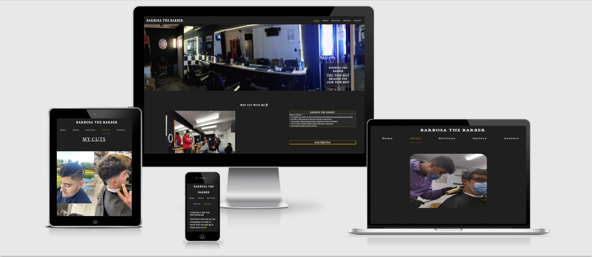
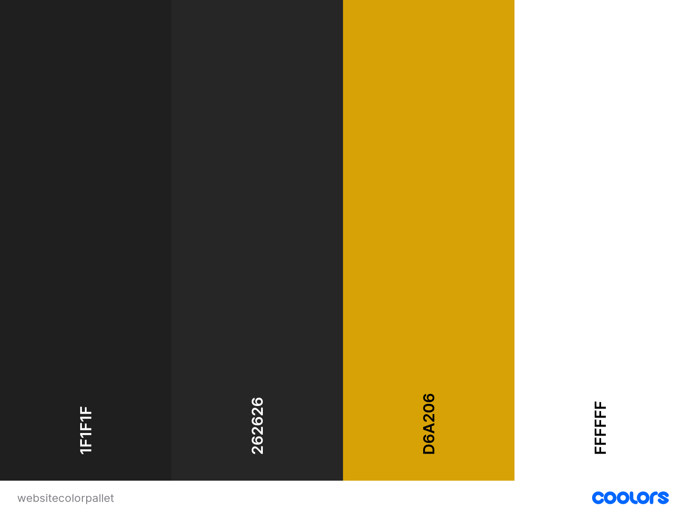

# Barbosa The Barber

The site was built to serve as a singular place where my brother, Guilherme, who is a barber, could promote his business. By consolidating all the information in one place, we hope to attract new customers.

Live Site : https://vitorbarbosadev.github.io/barbosathebarber/

---

## CONTENTS

* [User Experience](#user-experience-ux)
  * [User Stories](#user-stories)

* [Design](#design)
  * [Colour Scheme](#colour-scheme)
  * [Typography](#typography)
  * [Imagery](#imagery)
  * [Wireframes](#wireframes)

* [Features](#features)
  * [General Features on Each Page](#general-features-on-each-page)
  * [Future Implementations](#future-implementations)
  * [Accessibility](#accessibility)

* [Technologies Used](#technologies-used)
  * [Languages Used](#languages-used)
  * [Frameworks, Libraries & Programs Used](#frameworks-libraries--programs-used)

* [Deployment & Local Development](#deployment--local-development)
  * [Deployment](#deployment)
  * [Local Development](#local-development)
    * [How to Fork](#how-to-fork)
    * [How to Clone](#how-to-clone)

* [Testing](#testing)

* [Credits](#credits)
  * [Code Used](#code-used)
  * [Content](#content)
  * [Media](#media)
  * [Acknowledgments](#acknowledgments)

---

## User Experience (UX)

Barbosa the Barber has been steadily growing on all his social media platforms, and with an increasing clientele comes less time to answer questions.

Hence why this site exists in order to help aid and reduce the amount of questions he gets asked on a daily basis.

#### Key information for the site
* What are the prices.
* Pictures of haircuts.
* How to book.
* Where is the shop.
* Open Hours.

### User Stories

#### Client Goals
* To be able to view the site on a range of device sizes.
* To make it easy for potential customers to find out the information they are seeking.
* To ensure the customer can find the information quickly.
* To allow potiental customers to have a hub where they can arrange their next haircut.
#### First Time Visitor Goals
* I want to find out who Barbosa the Barber is.
* I want to be able to navigate the site easily to find information.
* I want to be able to find their social media profiles so I can see what their must recent cuts look like.
#### Returning Visitor Goals
* I want to see if any new photos have been added to the gallery.
* I want to book another haircut.
* I want to find social media links.
#### Frequent Visitor Goals
* I want to see what time the barber opens and the location.

## Design

### Colour Scheme

I wanted a cool and easy to read color scheme so I decided to go with a black background ,white text and gold accents for the colors as these colors contrast well together.

I created the pallet above to represent the colors used on the website [coolors](https://coolors.co/)

### Typography

[Google Fonts](https://fonts.google.com/) was used for the following fonts:

* EB Garamond is used for headings on the site. 

* Roboto Slab is used for the body text on the site.

* Serif was used as a backup incase the other two failed to load.

The reason I chose to use these fonts was because they are easy to read and complement each other very well. I also thought that they conveyed a professional vibe that suited Guilherme's youthful yet business-oriented personality.

EB Garamond (weight 500)

Roboto Slab (weight 400)

### Imagery

All images were provided by Guilherme they were mostly just haircut images and also some images from the store 

### Wireframes

## Features

The website consists of six pages, five of which can be accessed through the navigation menu. These include the Home, About, Services, Gallery, and Contact pages. The sixth page, a success page, is displayed once a user submits the form on the Contact page.

### All Pages on the website have:

A responsive navigation bar at the top, with the Barbosa The Barber logo positioned on the left and links to the different pages floated to the right. The currently selected page is highlighted with a gold underline to indicate the user's location on the site.

Additionally, every page includes a footer with two centrally placed social media links for TikTok and Instagram. The footer also carries the text "COPYRIGHT © VITOR BARBOSA" to denote the ownership of the website.

### Home Page.
* Hero Image Section: This section includes a hero image that covers the page. It also has a box in the right corner that contains a phrase.
* Why Cut with Me Section: This section has a centered H2 heading. It is then split into two; one side has an image of Guilherme standing, and the right side has a statement with a button to book underneath.
* Review Section: This section includes multiple images, each of them representing a different review.
* Tiktok Section: This section displays Guilherme's Tiktok feed.

#### About Page. 
* About me section.  This section is split into two. The left side features an image of Guilherme, while the right side contains a title and a statement.

#### Services Page. 
P Services We Offer section. This section contains a table that displays all the updated prices for each service that Guilherme offers as a barber.

#### Gallery Page.
* Pictures Section. This section is a collection of images which showcase different cuts.

#### Contact Page.
* Contact On Insta Section: This section, located on the left side of the page, contains a title and a paragraph. At the end of the paragraph, there's an Instagram button that will redirect the user to Guilherme's Instagram page.
* Barber Info Section: Next, we have a section that displays the location and operating hours of the barber. The location is shown using Google Maps, and the hours are presented in a table.
* Book Your Cut Section: Underneath everything, there's a form that allows the user to input their name, the type of haircut they want, and the day they want to get the haircut. Once they submit the form, they are redirected to the success page.

#### Success Page.
* This page is simiply a thank you message and then a button to go home 

#### Future Implementations.

* Use javascript to fetch the feed but written in my code so I have a bit more control over the styles and also what it is doing.
* Use javascript to hook up the form to some sort of service that will automacticly send an email to Guilherme telling him someone wants to book him.

### General features on each page

#### Images of each page to show responsiveness

### Accessibility

I adhered to all the recommended guidelines for accessibility. Here's what I implemented:

* Utilized semantic HTML for better structure and understanding.
* Included detailed alt attributes for images on the site.
* Added information for screen readers where images were used without accompanying text - for instance, I typed out the words in the image for the review.
* Ensured a sufficient color contrast across the site for better visibility.
* All links on the site are equipped with aria labels to provide clear instructions to screen readers.

## Technologies Used

### Languages Used

HTML and CSS were used to create this website.

### Frameworks, Libraries & Programs Used

[Balsamiq](https://balsamiq.com/wireframes/?gad=1&gclid=Cj0KCQjw98ujBhCgARIsAD7QeAh16EIe0q-IcDgGy2cm6wVutbTvuPBEZIro7SJRukcMBV_wYQTJqR8aAl8aEALw_wcB) - Employed for wireframe development.

[Git](https://git-scm.com/) - Utilized for managing different versions of the project.

[Github](https://github.com/) - Used as a repository to save and store the website's files.

[Google Fonts](https://fonts.google.com/) - Imported to use specific fonts on the website.

[Font Awesome](https://fontawesome.com/) - Incorporated for the website's icons.

[Am I Responsive?](https://ui.dev/amiresponsive) - Used to display the website's image across various devices.

[Photopea](https://www.photopea.com/) - Utilized for icon creation.

## Deployment & Local Development

### Deployment

The live website was launched using Github Pages. Follow these steps to do the same:

1. Sign in or create a new account on Github.
2. Locate the project repository named Barbosathebarber.
3. Navigate to Settings.
4. On the left navigation bar, select the Pages option.
5. In the Source section, select 'main' from the branch dropdown menu and 'Root' from the folder dropdown menu.
6. Click on Save. Your live Github Pages site is now active and can be accessed via the provided URL.

### Local Development

#### How to Fork

To create a fork of the Barbosathebarber repository, follow these steps:

1. Log in (or sign up) to Github.
2. Go to the repository for this project, VitorBarbosaDev/Barbosathebarber.
3. Click the Fork button in the top right corner.

#### How to Clone

To clone the Barbosathebarber repository, follow these steps:

1. Sign in or create a new account on Github.
2. Navigate to the project repository, VitorBarbosaDev/Barbosathebarber.
3. Click on the code button, choose your preferred cloning method (HTTPS, SSH or GitHub CLI) and copy the provided link.
4. Open your code editor's terminal and navigate to the desired location for the cloned directory.
5. Type 'git clone' into the terminal, paste the link you copied in the previous step, and press enter.

## Testing

You can view the testing that was done in the testing.md file that I created [here](TESTING.md)

## Credits

### Code Used

The only portions of code that I directly replicated with minor alterations were the hero image code and the gallery page code, both from the LoveRunning project. All other code was developed through a process of trial and error until successful.

### Content

Content was Written by Vitor Barbosa 

###  Media

All media used was provided by Guilherme Barbosa
  
###  Acknowledgments

I would like to thank

* Guilherme Barbosa for allowing me to do this project on his business 
* Alex my code institude mentor for checking over everything and making sure everything was ready to submit and answering my questions.
