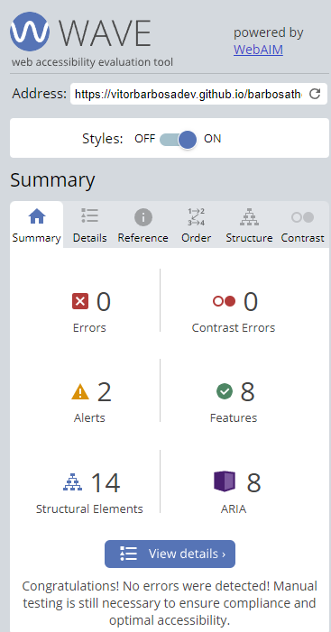
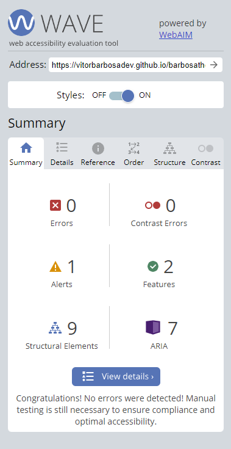
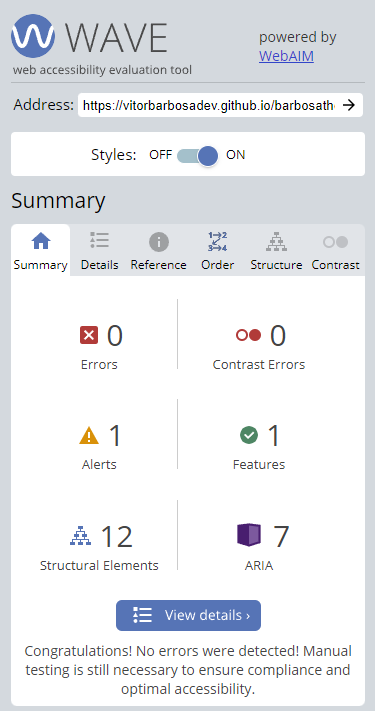
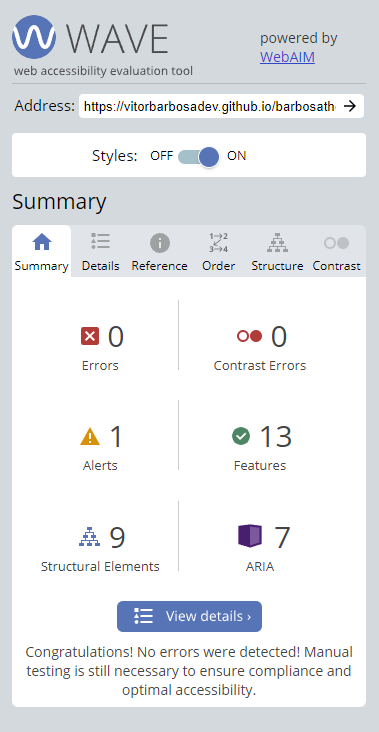
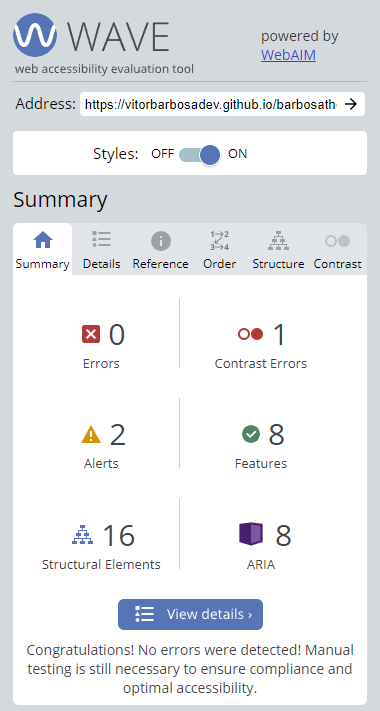

 Barbosa The Barber - TESTING
 

The site was build to be used a singular place where my brother guilherme who is a barber could promote his business and have all the information in one place in order to hopefully be able to aquire new customers 

Live Site : https://vitorbarbosadev.github.io/barbosathebarber/

---

## CONTENTS

* [AUTOMATED TESTING](#automated-testing)
  * [W3C Validator](#w3c-validator)
  * [Lighthouse](#lighthouse)
  * [WAVE](#wave)

* [MANUAL TESTING](#manual-testing)
  * [Testing User Stories](#testing-user-stories)
  * [Full Testing](#full-testing)

* [BUGS](#bugs)
  * [Known Bugs](#known-bugs)
  * [Solved Bugs](#solved-bugs)

---

## AUTOMATED TESTING

The Automated Testing includes all the testing that is carried out by a program, like W3C HTML validation.

###  W3C Validator
W3C was used to validate all pages and also the css.

#### Results for Index.html

#### Results for About.html

#### Results for Sevices.html

#### Results for Gallery.html

#### Results for Contact.html

#### **CSS Validation**

### Lighthouse
Lighthouse was used to on all pages below are the results
#### Desktop Testing

#### Results for Index.html

#### Results for About.html

#### Results for Sevices.html

#### Results for Gallery.html

#### Results for Contact.html

From my understanding the reason why this page is slow is because of the maps and time it takes to load.

#### Mobile Testing

#### Results for Index.html

#### Results for About.html

#### Results for Sevices.html

#### Results for Gallery.html

#### Results for Contact.html

### WAVE
Wave was used to test the accessibility of each page 

#### Results for Index.html
- 

#### Results for About.html
- 

#### Results for Services.html
- 

#### Results for Gallery.html
- 

#### Results for Contact.html
- 

The Contact page had a contrast error related to the styling on the button. 
You can view the error in this image: [Wave Contact Page Contrast Error](assets/images/testingimages/wave-contact-error.png).

You mentioned that the button on the Contact page has a white and gold color combination, which caused the contrast error. However, you like the way it looks and feel it fits the style of the page, so you've decided to leave it as it is. In the future, you plan to be more careful when selecting color combinations.

As you can see I white and gold and thats why it throw this error but it fit with my style and for all the other buttons they have a black background ,white text and gold border.
So I think I will leave this one as it is as I like the way it looks and it fits the style of the page but in future I will definitly be more careful on picking my color combinations.

## MANUAL TESTING

### Testing User Stories

👩🏻‍💻 View an example of a completed user stories testing section [here](https://github.com/kera-cudmore/BookWorm/blob/main/TESTING.md#Testing-User-Stories)

This is where you will test the user stories you created in the README against your site. I like to use a table for this section - I create a column for the user stories goals, how these have been achieved and I use the third column to add any supporting images.

### Full Testing

👩🏻‍💻 View an example of a completed full testing section [here](https://github.com/kera-cudmore/TheQuizArms/blob/main/TESTING.md#Full-Testing)

Full testing can be tedious, so it is great to try and break this part up into smaller chunks and do a bit at a time. Full testing is when you go through the site and test every single thing that can be tested. So for example you would test that all links in the navbar correctly redirect the user to where there are supposed to go. A table is the perfect way to display this information.

## BUGS

### Known Bugs

List (or put in a table) all known bugs on your site here as soon as you find them. This will prevent you from forgetting any at the end. Some (if not all) of these bugs will hopefully make their way over to the next section, solved bugs, as you progress through your project.

### Solved Bugs

👩🏻‍💻View an example of a completed bugs section [here](https://github.com/kera-cudmore/BookWorm/blob/main/TESTING.md#BUGS)

This is where all solved bugs go once squashed. List what the bug was, and how you managed to fix it. You can also include images/videos here if you wanted.
